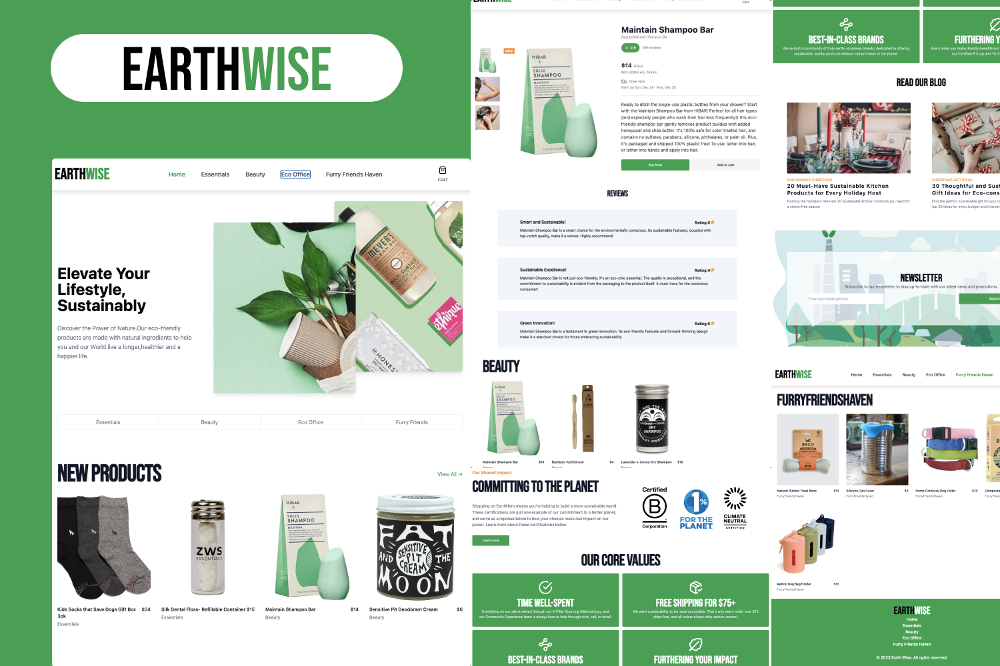

# [EarthWise E-Commerce Shop 🔗](https://earth-wise.vercel.app/)

## Introduction

Welcome to EarthWise, a simple, stylish, and fully responsive e-commerce platform designed with the modern shopper in mind. Our platform leverages the power of Next.js, Sanity, TailwindCSS, use-shopping-cart, and Shadcn UI to deliver an unparalleled shopping experience.

## Features

-   **Next.js Framework**: The website is built with Next.js, providing server-side rendering for faster page loads and improved SEO.
-   **Routing**: Users can easily navigate through the site using the routed pages for the home screen and product categories.
-   **Responsive Design**: EarthWise is fully responsive, ensuring a seamless experience on smartphones, tablets, and desktops.
-   **Sanity Database**: Our product database and categories are managed with Sanity, allowing for real-time updates and easy content management.
-   **Customization**: The Sanity database also manages header images, offering full customization to maintain brand consistency.
-   **TailwindCSS**: Thanks to TailwindCSS, EarthWise boasts a minimalist and modern design aesthetic.
-   **Persistent Shopping Cart**: The use-shopping-cart package provides users with a persistent shopping cart, making shopping convenient and user-friendly.
-   **Shadcn UI**: This UI library enhances the website's style and usability, contributing to an intuitive user interface.
-   **Integrated Checkout**: Users can securely checkout directly from the website, with Stripe handling payment processing.

## Pages

-   **Home Page**: Features various headings and showcases top products and categories.
-   **Category Page**: Displays products sorted by their respective categories for easy browsing.
-   **Product Page**: Contains detailed information about each product, including pricing and product images.
-   **Checkout**: A streamlined checkout process powered by Stripe for secure transactions.

## How to Use

1.  **Navigation**: Utilize the nav bar to explore different product categories or return to the home page.
2.  **Product Browsing**: Click on any category to view its products. You can also use the search function to find specific items.
3.  **Adding to Cart**: When you find a product you wish to purchase, add it to your cart with a single click.
4.  **Cart Management**: View your cart at any time to update quantities or remove items.
5.  **Checkout**: Proceed to checkout when you're ready to purchase. Stripe will guide you through the payment process.
6.  **Account Management**: Create an account to track your orders and save your shopping preferences.

## Getting Started

To get started with EarthWise, simply visit our homepage and begin exploring our diverse range of products. With EarthWise, sustainable shopping is just a click away.

## Support

For any inquiries or support issues, please contact our customer service team at support@earthwise.com. We are here to help make your shopping experience as enjoyable as possible.

## Contribution

If you're interested in contributing to EarthWise, please read our  [CONTRIBUTING]()  file for guidelines on how to submit pull requests.

----------

Thank you for choosing EarthWise for your online shopping needs. We're committed to providing you with a delightful and eco-friendly shopping experience.